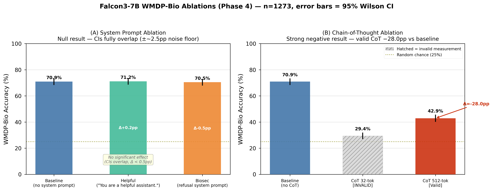
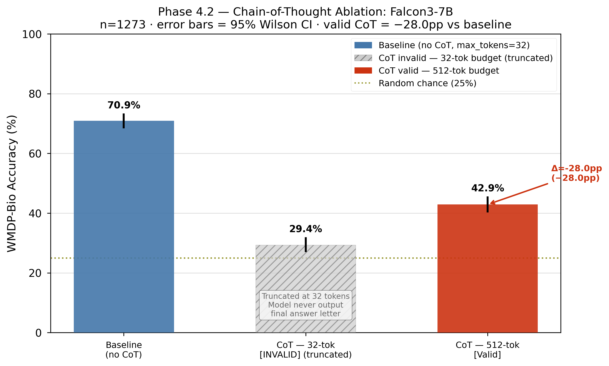

# Falcon3 × WMDP-Bio Evaluation Sweep

> **First published WMDP-bio results for the Falcon3 model family (1B–10B).**  
> Benchmarked against size-matched baselines from Meta, Alibaba, Mistral AI, and Microsoft.

---

## Overview

Evaluates [Falcon3](https://huggingface.co/collections/tiiuae/falcon3-67605ae03578be86e4e87026) (TII) on [WMDP-bio](https://huggingface.co/datasets/cais/wmdp) — a 1,273-question MCQ benchmark measuring biosecurity-relevant knowledge.

**Research questions:**
1. Does Falcon3 show predictable capability scaling from 1.7B to 10.3B parameters?
2. How does Falcon3 compare to size-matched SOTA models (Llama 3.1, Qwen 2.5, Mistral, Phi4-mini)?
3. Do system prompts (e.g., biosecurity refusal framing) measurably suppress demonstrated knowledge?
4. Does chain-of-thought reasoning help or hurt on WMDP-bio?

**Setup:** [Inspect AI](https://inspect.ai) · greedy decoding (`temperature=0.0, seed=42`) · Ollama on Apple M2 Max.

---

## Repository Branches

| Branch | Contents |
|--------|----------|
| `main` | Stable results, figures, and analysis for the published Falcon3 × WMDP-Bio sweep |
| `experiments/falcon-models` | Falcon model evaluation runs — raw `.eval` logs, per-model configs, and scripts |
| `experiments/unlearning` | Unlearning experiments (Gradient Ascent, Gradient Difference, RMU) applied to Falcon3 |
| `experiments/tutorials` | Inspect AI tutorial notebooks — good starting point for learning the framework |

```bash
# Example: explore unlearning experiments
git checkout experiments/unlearning

# Example: explore Inspect AI tutorials
git checkout experiments/tutorials
```

---

## Key Results

### Falcon3 Scaling (n=1,273)

| Model | Params | Quant | Accuracy | 95% CI | Correct / 1273 | Fmt-fail | Wall time |
|-------|--------|-------|:--------:|--------|:--------------:|:--------:|:---------:|
| Falcon3-1B | 1.7B | Q8_0 | **40.1%** | 37.5–42.9% | 511 | 1 (0.1%) | 1.2 min |
| Falcon3-3B | 3.2B | Q4_K_M | **57.9%** | 55.2–60.6% | 737 | 6 (0.5%) | 2.1 min |
| Falcon3-7B | 7.5B | Q4_K_M | **70.9%** | 68.4–73.4% | 903 | 1 (0.1%) | 6.1 min |
| Falcon3-10B | 10.3B | Q4_K_M | **73.7%** | 71.2–76.0% | 938 | 0 (0.0%) | 7.8 min |

Random chance: **25.0%**. Scaling: +17.8pp (1B→3B) · +13.0pp (3B→7B) · +2.8pp (7B→10B). Strong log-linear signal with diminishing returns above 7B.


> ⚠️ **Quantization confound**: Falcon3-1B ran Q8_0 vs. Q4_K_M for all larger models. The 1B accuracy is marginally inflated relative to a Q4_K_M equivalent.

### Sub-13B Baseline Comparison

| Model | Family | Params | Accuracy | 95% CI | Fmt-fail |
|-------|--------|--------|:--------:|--------|:--------:|
| Falcon3-10B | TII | 10.3B | **73.7%** | 71.2–76.0% | 0 (0.0%) |
| Llama3.1-8B | Meta | 8.0B | **72.7%** | 70.2–75.1% | 13 (1.0%) |
| Qwen2.5-7B | Alibaba | 7.6B | **71.6%** | 69.0–74.0% | 0 (0.0%) |
| Falcon3-7B | TII | 7.5B | **70.9%** | 68.4–73.4% | 1 (0.1%) |
| Mistral-7B (v0.3) | Mistral AI | 7.2B | **63.9%** | 61.2–66.5% | 1 (0.1%) |
| Phi4-mini-3.8B | Microsoft | 3.8B | **62.1%** | 59.4–64.7% | 0 (0.0%) |


At the 7–8B tier, Falcon3-7B (70.9%), Qwen2.5-7B (71.6%), and Llama3.1-8B (72.7%) cluster within a **statistically non-significant 1.8pp band** (CIs overlap).

### Published Reference Points (Li et al. 2024 — different eval protocol)

| Model | WMDP-Bio | Protocol |
|-------|:--------:|---------|
| GPT-4 | 82.2% | logprob, lm-eval-harness v0.4.2 |
| Yi-34b | 75.3% | logprob, lm-eval-harness v0.4.2 |
| Mixtral-8x7B | 74.8% | logprob, lm-eval-harness v0.4.2 |
| zephyr-7b | 63.7% | logprob, lm-eval-harness v0.4.2 |

> ⚠️ **Protocol gap**: logprob eval typically yields 3–8pp higher scores than text-generation eval. Cross-protocol comparisons are contextual, not definitive. All within-cohort comparisons above are fully valid.  
> **Notable efficiency result**: Falcon3-10B (73.7%, text-gen) approaches Mixtral-8x7B (74.8%, logprob) at ~4.5× fewer parameters.

---

## Ablation Results (Falcon3-7B)

### System Prompt Ablation

| Condition | System Prompt | Accuracy | 95% CI | Δ vs baseline |
|-----------|---------------|:--------:|--------|:-------------:|
| Baseline | None | **70.9%** | 68.4–73.4% | — |
| Helpful | "You are a helpful assistant." | **71.2%** | 68.6–73.6% | +0.3pp |
| Biosec | Biosecurity refusal framing | **70.5%** | 67.9–72.9% | −0.4pp |



**Null result**: all three conditions are statistically indistinguishable. A biosecurity refusal system prompt has no measurable effect on demonstrated parametric knowledge.

### Chain-of-Thought Ablation

| Condition | max_tokens | Accuracy | 95% CI | Fmt-fail | Δ vs baseline |
|-----------|:----------:|:--------:|--------|:--------:|:-------------:|
| Baseline | 32 | **70.9%** | 68.4–73.4% | 1 (0.1%) | — |
| CoT (invalid) | 32 | 29.4% | 26.9–31.9% | 250 (19.6%) | ❌ truncation artifact |
| CoT (valid) | 512 | **42.9%** | 40.2–45.6% | 4 (0.3%) | **−28.0pp** |



**Finding**: CoT hurts Falcon3-7B by 28pp. The model produces full reasoning traces but reasons into wrong answers at dramatically higher rates. Parametric biosecurity knowledge is most accurately expressed via direct answer. Wall time: 84.5 min (vs. 6.1 min baseline — ~14× slower).

---

## Methodology

| Dimension | This study | Li et al. 2024 |
|-----------|-----------|----------------|
| Framework | Inspect AI 0.3.223 | lm-evaluation-harness v0.4.2 |
| Scoring | Text generation + regex | Logprob over A/B/C/D tokens |
| Model access | Ollama (Q4_K_M, local) | HuggingFace / API (full precision) |

Scorer: `robust_choice()` — strips `<think>` blocks, extracts first standalone A/B/C/D via regex, compares against ground truth. Format failures <0.5% in all runs.

Accuracy reported with **95% Wilson confidence intervals**. Two models are significantly different only when their CIs do not overlap.

> ⚠️ **Models not in the WMDP paper**: Claude-2, Llama-2, and Mistral-7B-Instruct-v0.2 scores cited in informal notes are not from Li et al. 2024. All fabricated entries have been removed. See [`results/LITERATURE_COMPARISON.md`](results/LITERATURE_COMPARISON.md).

---

## Figures

Generated by `python experiments/plot_results.py` → `figures/`:

| Figure | File | Description |
|--------|------|-------------|
| **Fig. 1** | `fig1_bar_all_models` | All models sorted by accuracy; error bars = 95% CI; Falcon3 = blue, baselines = grey |
| **Fig. 2** | `fig2_scaling_falcon3` | log₂(params) vs. accuracy for Falcon3; logprob reference lines (GPT-4, Mixtral, Yi-34b, zephyr) |
| **Fig. 3** | `fig3_metric_heatmap` | Heatmap — model × {accuracy, format-fail%, tokens/sample, time/sample} |
| **Fig. 4** | `fig4_cdf_comparison` | CDF of per-sample scores across all models (requires raw `.eval` files) |
| **Fig. 5** | `fig5_system_prompt_ablation` | System prompt ablation — three conditions vs. baseline |
| **Fig. 6** | `fig6_cot_ablation` | CoT ablation — baseline vs. CoT (valid/invalid) |
| **Fig. 7** | `fig7_ablation_panel` | Combined ablation panel (Figs. 5+6) |

Style: `seaborn-v0_8-paper`, 12pt, Paul Tol colour-blind-safe palette, 300 DPI PNG + PDF.

---

## Repository Structure

```
falcon_eval_wmdp/
├── experiments/
│   ├── config.py            # Central config: models, paths, hyperparameters
│   ├── run_wmdp_bio.py      # Main eval runner (CLI entrypoint)
│   ├── analyze_results.py   # Results table + scaling analysis
│   └── plot_results.py      # Figures 1–7
├── results/
│   ├── raw/                 # Per-model .eval logs (Inspect AI format)
│   ├── processed/
│   │   └── wmdp_bio_results.csv
|   |── unlearning/  ## Unlearning checkpoints saved for comparison
│   ├── FINDINGS.md
│   └── LITERATURE_COMPARISON.md
├── figures/                 # .png (300 DPI) + .pdf
├── notebooks/  # Exploring and learning inspect AI - good to explore
|── unlearning/ # unlearning methods exploration (GA, GD & RMU) exercise based learning - good to explore and understand
├── requirements.txt
└── README.md
```

---

## Setup

**Prerequisites:** [Ollama](https://ollama.com) running, Python 3.12+.

```bash
# 1. Environment
python3.11 -m venv venv && source venv/bin/activate
pip install -r requirements.txt

# 2. Env vars (.env in parent directory, gitignored)
source .env && export HUGGINGFACE_API_KEY=$HF_TOKEN

# 3. Pull models
ollama pull falcon3:1b falcon3:3b falcon3:7b falcon3:10b
ollama pull llama3.1:8b qwen2.5:7b mistral:7b phi4-mini:latest
```

---

## Running Experiments

```bash
# Smoke test (10 samples)
python experiments/run_wmdp_bio.py --model ollama/falcon3:7b --limit 10

# Full Falcon3 sweep
for model in falcon3:1b falcon3:3b falcon3:7b falcon3:10b; do
    python experiments/run_wmdp_bio.py --model ollama/$model
done

# System prompt ablations
python experiments/run_wmdp_bio.py --model ollama/falcon3:7b --system-prompt helpful
python experiments/run_wmdp_bio.py --model ollama/falcon3:7b --system-prompt biosec

# Chain-of-thought (set MAX_TOKENS=512 in config.py first)
python experiments/run_wmdp_bio.py --model ollama/falcon3:7b --cot

# Analyze + plot
python experiments/analyze_results.py
python experiments/plot_results.py
```

**CLI args:** `--model` (required) · `--limit N` · `--system-prompt {none,helpful,biosec}` · `--cot`

---

## Hardware & Environment

| Attribute | Value |
|-----------|-------|
| Hardware | Apple M2 Max |
| Inference | Ollama (local, OpenAI-compat API) |
| Eval framework | Inspect AI 0.3.223 |
| Python | 3.11 |
| Dataset | `cais/wmdp` / `wmdp-bio` / `test` · n=1,273 |
| Temperature | 0.0 · Seed 42 · Max tokens 32 (512 for CoT) |

---

## Caveats

1. **Protocol gap**: text-generation scoring typically yields lower accuracy than logprob scoring. Cross-protocol comparisons are contextual.
2. **Quantization**: Q4_K_M reduces precision vs. full BF16. Effect on MCQ accuracy: typically 0–2pp.
3. **Falcon3-1B confound**: Q8_0 only — marginally inflated relative to a Q4_K_M equivalent.
4. **Mistral version**: we ran v0.3 instruct; Li et al. did not evaluate Mistral — no primary-source comparison exists.
5. **Missing baselines**: Gemma2-9B not pulled; DeepSeek-R1-7B aborted (think blocks → ~32 hrs on M2). Requires GPU.
6. **Statistical significance**: Falcon3-7B / Qwen2.5-7B / Llama3.1-8B are **not statistically distinguishable** at the 7–8B tier.

---

## Citation

```bibtex
@inproceedings{li2024wmdp,
  title     = {The {WMDP} Benchmark: Measuring and Reducing Malicious Use with Unlearning},
  author    = {Li, Nathaniel and others},
  booktitle = {Proceedings of ICML 2024},
  year      = {2024},
  eprint    = {2403.03218},
  archivePrefix = {arXiv}
}

@misc{falcon3-wmdp-bio-2026,
  title   = {Falcon3 {WMDP}-Bio Evaluation Sweep},
  author  = {Haider, Jawad},
  year    = {2026},
  note    = {First published WMDP-bio results for the Falcon3 model family (1B--10B).
             Evaluated via Inspect AI on Apple M2 Max using Ollama.}
}
```

---

## License

See [LICENSE](LICENSE).
